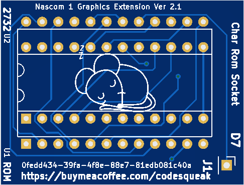

# Full Nascom 2 Graphics on a Nascom 1

This board allows full N2 graphics on a Nascom 1

## Introduction

This board accepts 2732 programmed with the complete Nascom 2 character set. This replaces  It replaces the existing Nascom 1 character ROM

Original data -> 0x0000 to 0x07FF

Graphics Data -> 0x0800 to 0x0FFF

Nascom 1 Required Modification

IC 20 Pin 12 to IC 17 Pin 18

IC 17 Pin 19 to IC 16 Pin 14

J1 wire link to IC 15 Pin 6 (Bend pin out of socket for wire link)

