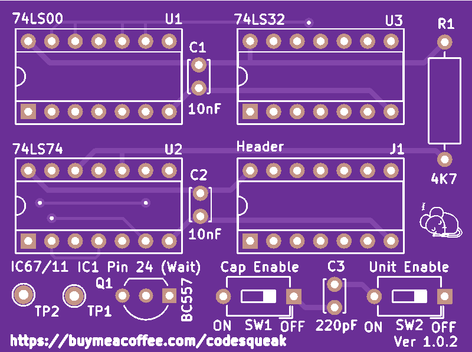
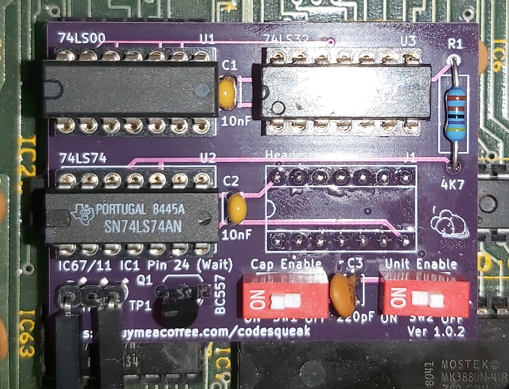

# Nascom 2 Screen Flash Eliminator

A gadget to reduce screen flash on N2 video

## Introduction

This was developed from the long defunct add on from EDAC, as I found that the unclean video from the Nascom 2 lead to VGA converters having problems producing a stable image. This improved the output considerably in my experience.

