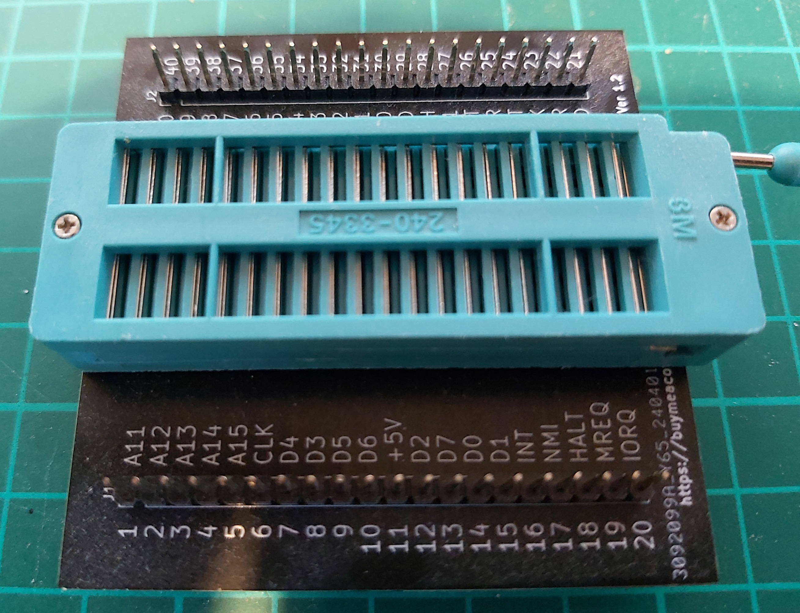
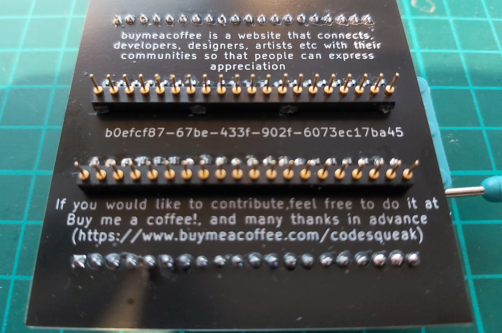

# Z80 Breakout Board

A board to allow easy access to Z80 pins / use of a ZIF socket

## Parts:

1. 40 pin ZIF socket
2. 2 x 20 turned pin SIL strips (Pins to go into the socket on the target system)
3. 2 x 20 pin SIL strip (Pins for the scope / LA connections). Lot’s on eBay – used a lot with RPi’s etc – Usually a lot cheaper than the turned pin strips !

## Construction

1. Solder the turned pin strips in first. (On the bottom of the board)
2. Trim down with snips on the top as the ZIF socket will sit on top of this.
3. Solder the scope / LA pin strips on the top of the board
4. Trim any pins sticking out the bottom
5. Solder in the ZIF socket – Be careful, it’s a bit close to the SIL strips used to insert into the CPU socket
6. Add pins to the +5v and GND via’s if you want these
7. Test all pins to make sure you have not shorted any while soldering.

