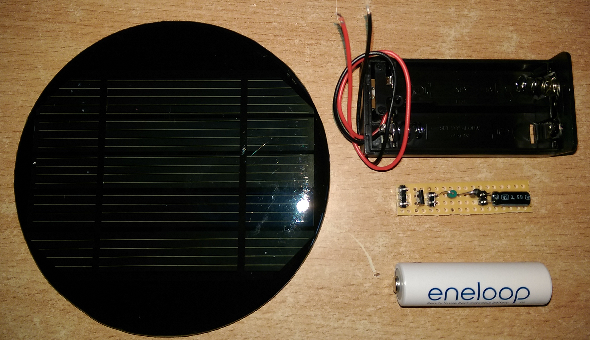

# Solar Garden Light

Keywords: Garden light, solar light, LED, solar, circuit, QX5252F, oshpark, jlcpcb

## The Problem

I have a number of post type solar garden lamps, with small circular solar cells at the top.  These suffer from a number of problems:

* The cell is too small to supply adequate power in the winter
* The plastic coating on the cell degrades and becomes opaque
* The electronics suffer from corrosion
* The illumination level is low

## The Solution

I decided to see if it was possible to replace the electronics package with something that would address the issues:

* A larger, better packaged (hopefully!) solar cell was sourced
* An efficient circuit was designed around the QX5252F LED driver
* The electronics package was small enough to be dipped in a protective coating and housed in a closed container

## Circuit

After looking at and testing various designs / component values I found the following configuration to be optimal.  

| Component | Value | Comment |
|:---|:---|:---|
| QX5252F | TO-94 |  [Datasheet](https://www.mikrocontroller.net/attachment/158139/QX5252.pdf) |
| Solar Cell | 2.5V | Select something that will supply adequate power in winter |
| Inductor | 100µH | Alter this values to control the available current |
| Ni-MH Battery | 1.2V | Select something with adequate storage - 1900mAh Ni-MH Eneloop's seem to do the job but overspec'd |
| Diode | 1N5817 | Anything with a low voltage drop will do |
| LED | 20mA / 17500 mCd | Nice and bright with good coverage. Obtained some from [Kitronik](https://www.kitronik.co.uk) |
| Capacitor | 1μF | Electrolytic. Serves to increase brightness noticeably but uses more power.  Useful for stablizing power for self colour changing LED's |

_*Note*_: The capacitor is optional and is only essential when you use colour changing LED's.  If you just want to change the brightness, change the inductor.

## Completed Item and Housing

The circuit can be implemented on a small piece of Vero-board.  This is small enough to fit within the space taken by one AA cell. Closed dual AA cell
battery holders are common and cheap to obtain from eBay, thus solving the protective environment issue.

The battery holder is then affixed onto the base of the solar cell using a silicone sealant.  
Make sure to use a 'non-corrosive' type as some will attack various materials including copper.

### Built Up Circuit - Front

Note: For testing, the solar cell, battery and LED are broken out on 2.54mm Dupont connector pins.  For long environmental life you may
want to solder the connecting wires before coating the whole unit with a conformal coating / liquid tape etc

### Built Up Circuit - Back

Not the best image - the camera seemes to have problems with the shiny copper surface.

### PCB - JLC

I also had a number of PCB's made up by [JLC](https://jlcpcb.com/). Very cheap, fast delivery and I like the selection of colours.  

The gebers for both [JLC](https://jlcpcb.com/) and [OSHPARK](https://https://oshpark.com/) are included in the project if you want to make your own

### Component Size Comparison

